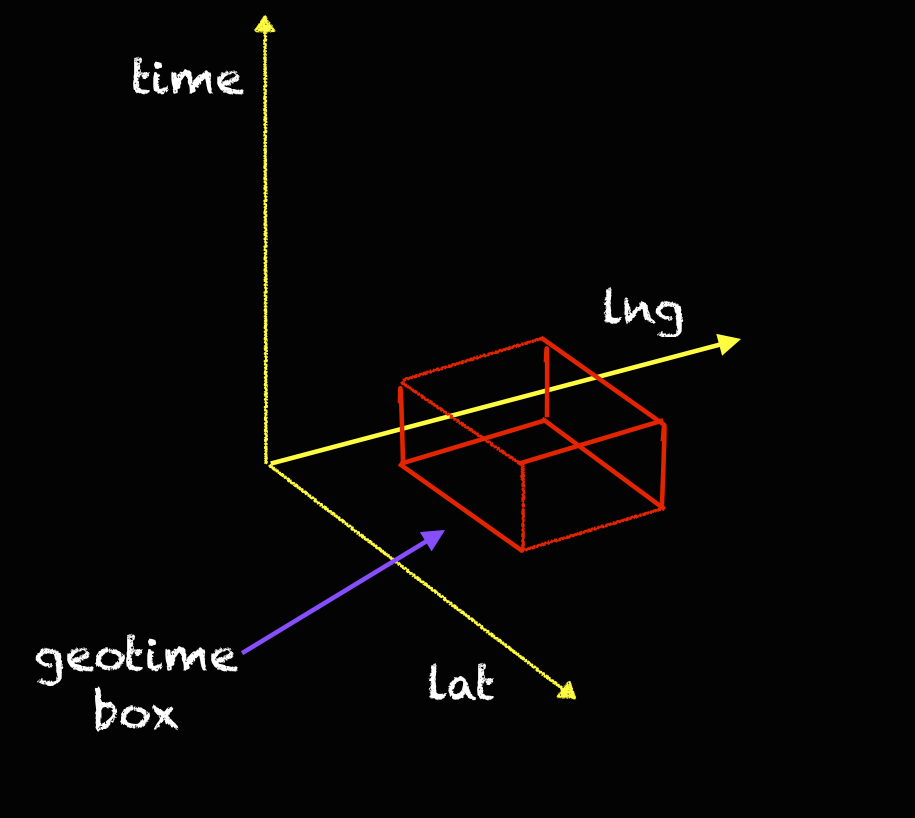

# geotime
A library for indexing space and time entities on a map


## Introduction
Geographic coordinates can be indexed into compact representations called "geohashes". These hashes index the world into increasingly smaller boxes as you increase the precision, and all use their own encoding schema (hex, base64, utf-8). If this is a new concept, read more about it [here](https://en.wikipedia.org/wiki/Geohash).
Just like space, time can also be indexed. We have epoch time, describing the seconds past midnight on January 1, 1970. If you translate epoch time to binary format and read the bitstring left to right (big endianess), you can do the same as you do in geohashing.

The purpose of this library is to create space+time boxes instead of just space or time boxes.



## Setup
- Option 1: Install with `python setup.py install`
- Option 2: Place the `geotime.py` file in your project

## Usage
```
import geotime
import time

# create an object
my_geotime = geotime.geotime()
my_geotime.geo = [38.9072, -77.0369]
my_geotime.geo_precision = 60
my_geotime.time = 1514764800 # January 1, 2018
my_geotime.precision = 42
print(my_geotime.encode())
print(my_geotime.get_precision())

# or just use the library functions
print(geotime.encode([38.9072, -77.0369],1514764800,60,42)
```

## Contact
[Mike](mail:mroumanos@protonmail.com)